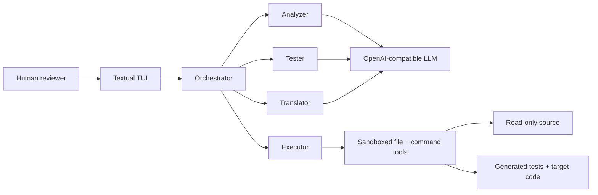
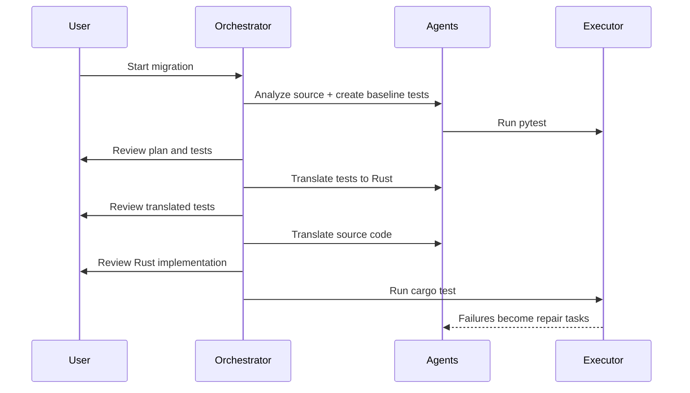

# Agentic Code Migration for Good

## Safer AI-assisted software migration

**Demo today:** Python to Rust  
**Bigger idea:** a reusable migration harness for many source and target languages

---

# The Problem

Critical software often gets trapped in legacy code.

- Rewrites are expensive, slow, and risky
- Behavior is hidden in edge cases, not documentation
- Small organizations often lack the time or specialists to modernize systems
- AI can write code, but unvalidated AI rewrites are hard to trust

This creates an access gap: well-funded teams can modernize, while smaller teams are left maintaining slower, harder-to-scale software.

**For AI for Good:** safer modernization helps civic tech, research tools, NGO systems, and public-interest software stay useful for the long term.

---

# Our Solution

An agentic migration pipeline that treats translation as an engineering workflow, not a one-shot prompt.

1. Understand the source project
2. Capture behavior as tests
3. Translate tests into the target ecosystem
4. Translate implementation
5. Run real tooling and repair failures
6. Keep a human in the loop at key decisions

**Core promise:** migrate with guardrails: tests, review, isolation, and feedback loops.

---

# Efficiency = Sustainability

Many important Python libraries are easy to use, but expensive to run at scale.

Updating performance-critical parts to Rust can:

- Reduce CPU time and cloud costs
- Lower energy use for repeated workloads
- Make tools faster on older or cheaper hardware
- Extend the lifetime of useful open-source projects
- Help small teams get production-grade performance without rewriting everything by hand

**Sustainability is not only environmental. It is also making good software maintainable, affordable, and accessible over time.**

---

# What We Built

**Agentic Py2Rust Migrator**

- Textual terminal UI for running and monitoring the migration
- LLM-backed Analyzer, Tester, and Translator agents
- Executor tools for reading, writing, and running commands safely
- Human approval checkpoints before moving to the next stage
- Validation through `pytest`, `cargo test`, linting, and retry loops

The original source project is never modified.

---

# System Architecture

**Why this matters:** the AI agents do not freely mutate the original project. They work through constrained tools and reviewable artifacts.

---

# Migration Workflow

---

# Why Judges Should Care

Most AI coding demos show code generation.  
This system shows **code migration with accountability**.

- Test-first: behavior is captured before implementation translation
- Human-centered: reviewers approve plans, tests, and code
- Tool-grounded: agents run real project commands, not just reasoning
- Safe by design: source is read-only; outputs are isolated
- Iterative: failures trigger targeted agent repair loops

---

# Demo Story

In the demo, we can show:

1. Select an LLM provider and model
2. Start migration on a Python project
3. Watch agents create a migration plan and Python tests
4. Approve or correct generated artifacts
5. Generate Rust tests and Rust implementation
6. Run `cargo test`
7. Show failed tests becoming concrete repair tasks

**Narrative:** the user stays in control while the system does the repetitive migration work.

---

# Beyond Python to Rust

Python to Rust is the first proof point, not the limit.

The reusable pattern is:

| Migration stage | Python to Rust today | Other languages tomorrow |
|---|---|---|
| Analyze source | Python project analysis | Source-language profile |
| Capture behavior | `pytest` tests | Source test runner |
| Translate tests | Rust integration tests | Target test framework |
| Translate code | Rust crate | Target project scaffold |
| Validate | `cargo test` | Target build/test command |

The same orchestration loop can support other pairs by swapping language profiles, prompts, layouts, and validators.

---

# Example Language Profiles

The system can be extended with language-specific adapters:

- **JavaScript to TypeScript:** infer behavior, generate typed implementation, validate with `npm test`
- **Python to Go:** capture Python behavior, generate Go tests, validate with `go test`
- **Java to Kotlin:** preserve JVM behavior, validate with Gradle or Maven
- **R to Python:** migrate data-science utilities, validate numerical outputs
- **MATLAB to Python:** modernize research scripts while preserving scientific results

**Key idea:** agents remain the same; the language profile changes.

---

# Why This Is Better Than Direct Translation

A direct prompt asks: "Convert this code."

Our system asks:

- What behavior must be preserved?
- What tests prove the behavior?
- What should a human approve before moving forward?
- What does the target compiler or test runner say?
- Which agent should fix the failure?

This turns migration from a guessing problem into a controlled feedback loop.

---

# Current State

Built and working as a Python-to-Rust migration harness:

- Agent roles and workflow controller are implemented
- Sandboxed executor tools are implemented
- Read-only source and isolated output folders are implemented
- Human review gates are implemented
- LLM provider selection is implemented
- Test, lint, and repair loops are implemented

Next step for full multi-language support: formalize language profiles so prompts, folder layout, and validation commands become configuration.

---

# Impact

This can help teams modernize important codebases without losing trust.

- Nonprofits can keep tools maintainable
- Researchers can migrate fragile scripts into production-ready languages
- Civic tech teams can reduce security and reliability risks
- Small teams can get expert-level migration scaffolding

**Vision:** make software modernization safer, cheaper, and accessible to teams that cannot afford large rewrite projects.

---

# Ask / Next Steps

We are looking for feedback on:

- Which language pairs matter most for real-world social impact?
- What validation guarantees would make users trust the migration?
- Which review experience would help non-experts supervise the process?

**Hackathon goal:** prove the migration workflow with Python to Rust, then generalize it into a language-agnostic migration platform.

---

# Closing

## AI should not just generate code.

It should help preserve behavior, reduce risk, and make software easier to maintain.

**Agentic Code Migration for Good**  
Test-driven, human-reviewed, extensible across languages.
