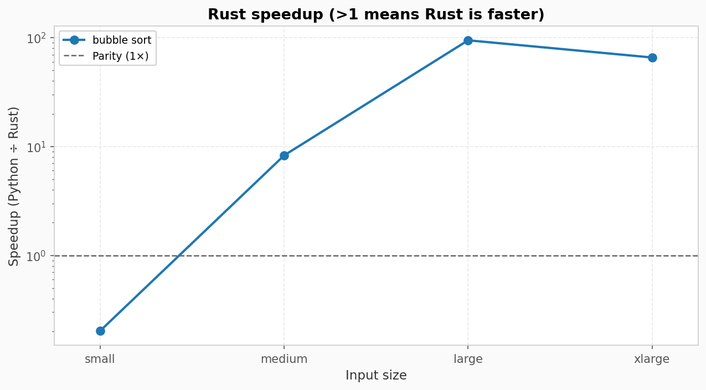
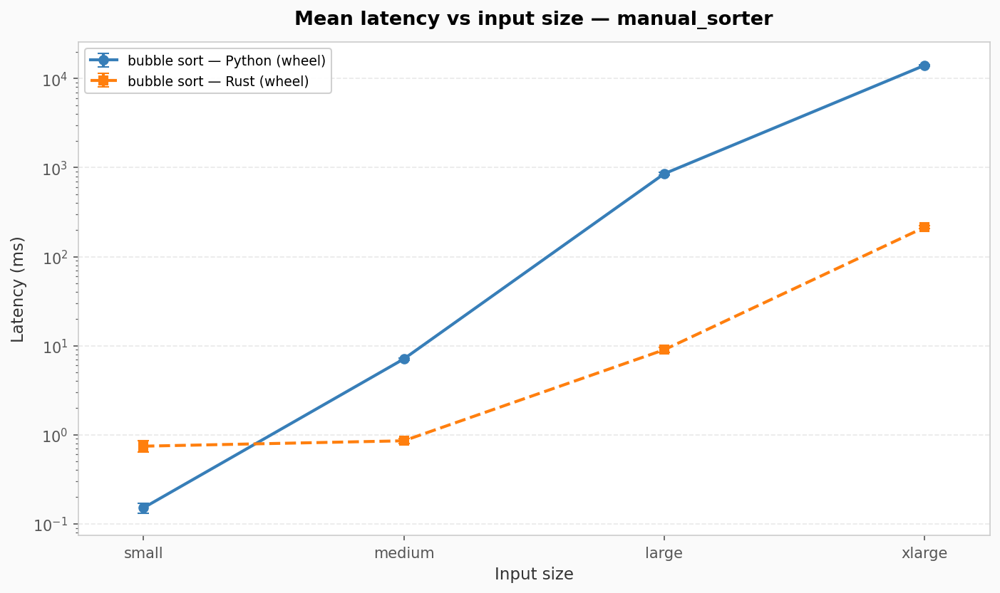
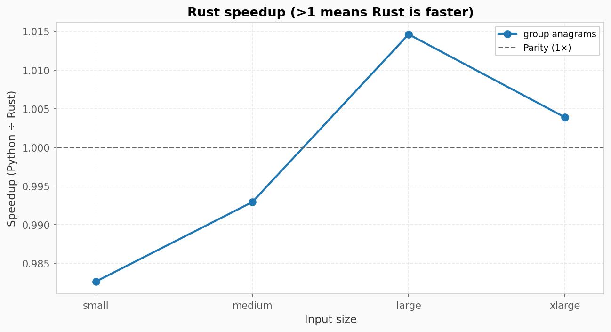
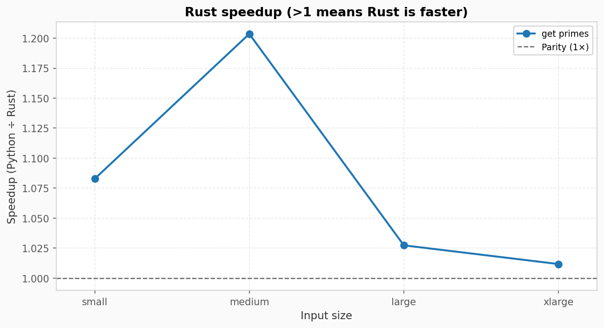
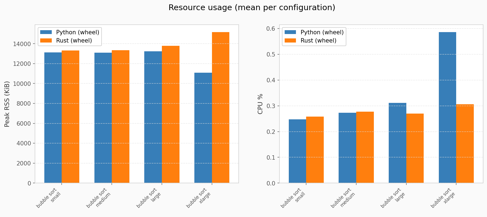
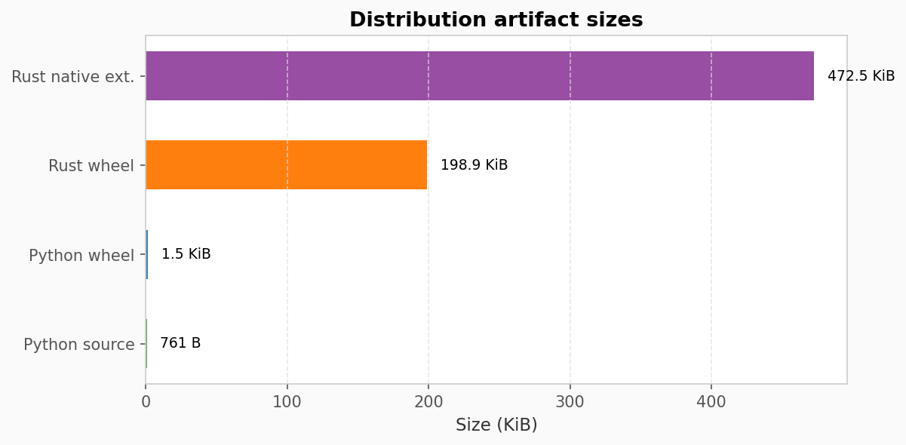

<!-- _class: title -->

# Trustworthy AI Software Modernization

## From risky rewrites to tested, measured migration

Demo: Python to Rust with PyO3
Evidence: screenshots + benchmarks
Vision: language-agnostic modernization

**AI should help valuable software survive technological change.**

---

<!-- _class: section -->

# The Problem

Important software often survives longer than the technology stack it was built on.

- Rewrites are expensive, slow, and risky
- Behavior is hidden in edge cases, not documented
- Small organizations often lack the time or specialists to modernize systems
- AI can write code, but unvalidated AI rewrites are hard to trust

<strong>The modernization gap:</strong> AI can accelerate migration, but only transparent, tested, and measurable workflows can make it safe and accessible for everyone.

---

# Why Modernize Code?

Migration is not about chasing a newer language. It is about making useful software cheaper, safer, and easier to keep alive.

<strong>Price</strong>Moving from expensive proprietary ecosystems, such as MATLAB, to open ecosystems like Python can lower licensing barriers.

<strong>Sustainability</strong>Moving code to more efficient languages can reduce CPU time, lowering energy use and cloud cost for repeated workloads.

<strong>Longevity</strong>Updating older code to newer languages, runtimes, and package formats extends its useful lifetime.

<strong>Security</strong>Rust can prevent many buffer and use-after-free bugs at compile time, reducing risk in performance-critical code.

<strong>Modernization makes software more accessible:</strong> cheaper to adopt, cheaper to run, easier to maintain, and safer to depend on.

---

# Our Approach

We turn code migration into an engineering workflow instead of a one-shot prompt.

<strong>Preserve behavior first</strong>Generate pytest suites against the original project before replacing implementation.

<strong>Reimplement with guardrails</strong>Translate into a Rust PyO3 extension while preserving the Python-facing API.

<strong>Validate with real tools</strong>Run linting, Rust quality gates, maturin builds, installed-wheel pytest, and fix loops.

<strong>Measure the result</strong>Benchmark isolated Python and Rust wheel installs and produce graph/report artifacts.

---

# Architecture

Human reviewer

&rarr;

Textual TUI

&rarr;

Orchestrator

&rarr;

Analyzer

Py Tester

Reviewer

Scaffolder

Translator

Executor

Benchmarker

Agent pool

&rarr;

Read-only source

PyO3 Rust wheel

pytest validation

benchmark reports

<strong>Safety rule:</strong> the original source project is read-only. Generated tests, Rust code, and measurements go to separate output folders.

---

# Migration Workflow

<strong>1. Capture behavior</strong>Analyze the Python project and generate pytest that documents current behavior.

<strong>2. Human review</strong>Reviewer summarizes coverage, risks, and suggested focus before approval.

<strong>3. Scaffold Rust</strong>Create a PyO3/maturin project that preserves the Python import surface.

<strong>4. Translate behavior</strong>Implement Rust behind the same Python-facing API.

<strong>5. Validate wheel</strong>Build with maturin, install the wheel, and run the same pytest suite.

<strong>6. Measure impact</strong>Compare isolated Python and Rust wheels and produce reports and graphs.

---

<!-- _class: section -->

# Why Python to Rust?

Python is accessible and widely used. Rust is fast, memory-safe, and efficient.

That makes Python-to-Rust a strong first case study:

- Keep the Python API that users already know
- Move performance-critical internals to Rust
- Build a distributable wheel with PyO3 and maturin
- Validate that behavior still matches the original package
- Measure whether the migration actually improves performance

**The point is not only Rust. The point is trustworthy modernization.**

---

# Why Judges Should Care

Most AI coding demos show generation. This project shows preservation.

<strong>Trust</strong>Behavior is encoded as tests before implementation is replaced.

<strong>Transparency</strong>Human reviewers see plans, generated artifacts, risks, and summaries.

<strong>Accountability</strong>Success is checked by compilers, test runners, and benchmark reports.

<strong>Access</strong>Small teams get a guided modernization workflow normally reserved for larger organizations.

---

<!-- _class: section -->

# Beyond Python to Rust

Python to Rust is the first proof point, not the limit.

<strong>What stays the same</strong>Analyze, test, review, translate, validate, repair, measure.

<strong>What changes</strong>Language prompts, project scaffold, package tools, test runner, and benchmark adapter.

<strong>What this enables</strong>Language-agnostic migration profiles for different modernization goals.

Examples: MATLAB to Python for cost, Python to Rust for efficiency, JavaScript to TypeScript for maintainability.

---

# Current State

Implemented in the repo today:

<strong>Workflow</strong>Six-step pipeline: tests, review, PyO3 translation, review, wheel validation, benchmarking.

<strong>Agents</strong>Specialized roles for analysis, testing, review, scaffolding, translation, execution, and measurement.

<strong>Quality gates</strong>flake8, mypy, baseline pytest, cargo fmt, cargo clippy, maturin build, installed-wheel pytest.

<strong>Proof artifacts</strong>Screenshots, benchmark reports, CSV files, metadata, and generated graphs.

---

<!-- _class: demo -->

# Demo Evidence

## The system runs end-to-end inside the TUI

Human review
Agent logs
Benchmark completion

The next slides show actual demo artifacts from this repo.

---

# Demo: Human Review Gate

The reviewer summarizes generated Rust/PyO3 source before the user approves or sends feedback.

---

# Demo: Migration Complete

After validation, the benchmarker runs and the migration pipeline completes with report artifacts written to disk.

---

# Demo: Measured Speedup

Manual sorter benchmark: Rust reaches up to 94.68x speedup on large inputs.

Latency comparison across input sizes from installed Python and Rust wheels.

---

# Demo: Not Every Case Is The Same

Anagram grouping improves on larger inputs, but Python wins on very small inputs.

Prime generation is closer to parity, showing why measurement matters.

---

# Demo: Resource Evidence

Resource graphs help connect performance to cost and sustainability.

Artifacts include build size and package-size tradeoffs, not just speed.

---

<!-- _class: section -->

# Impact

Remember why modernization matters:

<strong>Price</strong>Open and efficient ecosystems reduce licensing, infrastructure, and operational costs.

<strong>Sustainability</strong>Faster code can use less CPU, lowering energy use for repeated workloads.

<strong>Longevity</strong>Updating old code keeps important systems usable for future teams.

<strong>Access</strong>Smaller organizations can modernize without needing a large rewrite budget.

**Goal:** make trustworthy modernization available to the teams that need it most.

---

# Ask / Next Steps

We are looking for feedback on:

- Which language pairs create the most social impact?
- What evidence makes users trust an AI-assisted migration?
- Which benchmark metrics matter most: latency, cost, energy, memory, or package size?
- How should human review work for non-expert maintainers?

<strong>Hackathon goal:</strong> prove trustworthy Python-to-Rust modernization, then generalize the pattern into migration profiles for many language pairs.

---

<!-- _class: closing -->

# Closing

## AI should help software survive technological change.

Not just generate new code, but preserve behavior, reduce migration risk, and extend the life of important systems.

**Agentic Code Migration for Good**  
Test-driven. Human-reviewed. Benchmarked. Built for trustworthy modernization.
