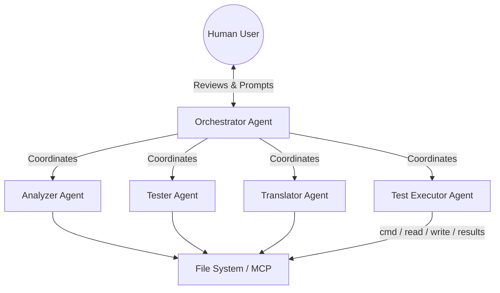
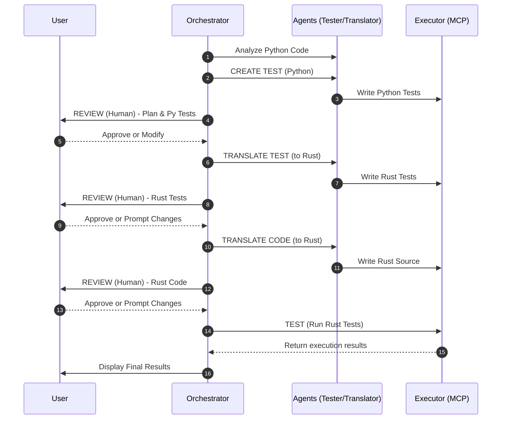

# Agentic Py2Rust Migrator

An agentic terminal tool designed to autonomously migrate Python projects to Rust using a Test-Driven Development (TDD) approach, with human-in-the-loop review stages to ensure high-quality, verifiable translations.

This project is designed to be developed using Cursor, leveraging multi-agent orchestration to divide the complex task of codebase migration into manageable, verifiable steps.

## System Architecture

Based on the whiteboard design, the system relies on an **Orchestrator** managing specialized agents, which all interact with the system via an MCP (Model Context Protocol) or direct File/Command interface.




### Agent Roles

1. **Orchestrator Agent (`Orkest`)**: The master controller. Manages state, prompts the user for reviews at specific checkpoints, and delegates tasks to the sub-agents.
2. **Analyzer Agent**: Reads the provided Python files/project to understand the structure, dependencies, and core logic.
3. **Tester Agent**: Responsible for writing unit tests. It first writes tests for the original Python code, and later translates those tests into Rust.
4. **Translator Agent**: Converts the Python source code into Rust source code, ensuring it aligns with the generated Rust tests.
5. **Test Executor Agent**: Interacts with the terminal to run test commands (e.g., `pytest`, `cargo test`) and handles file reading/writing (the MCP layer).

---

## Migration Workflow (Human-in-the-Loop)

The migration process follows a strict 6-step pipeline ensuring the generated Rust code behaves exactly like the Python code.



### Step-by-Step Breakdown:

1. **CREATE TEST (PY)**: The Analyzer and Tester agents read the Python project and generate comprehensive Python test cases to establish a baseline of the current behavior.
2. **REVIEW (HUMAN)**: The Orchestrator pauses execution. The user reviews the migration plan and the generated Python tests.
3. **TRANSLATE TEST**: The Tester agent converts the approved Python tests into equivalent Rust tests (e.g., using `#[test]`).
4. **REVIEW**: The user reviews the generated Rust tests. The user can prompt the agent to make adjustments or add edge cases.
5. **TRANSLATE CODE**: The Translator agent converts the actual Python implementation into Rust.
6. **TEST**: The Executor agent runs `cargo test`. The Orchestrator evaluates the results. If tests fail, it can loop back to the Translator to fix the code, or present the results to the user.

---

## Cursor Development Guide

This `README.md` is designed to be the foundational context for Cursor. When building this project:

1. **Phase 1: The Executor (MCP)**: Start by building the file read/write and command execution utilities. These are the tools all agents will need.
2. **Phase 2: The Orchestrator CLI**: Build the basic terminal interface that can pause for user input (the Human-in-the-loop mechanism). Run with `uv run orchestrator` (optional `-w /path/to/project`).
3. **Phase 3: LLM Integration & Prompts**: Define the system prompts for each specific agent role (Tester, Translator, Analyzer).
4. **Phase 4: Workflow Implementation**: Tie the agents together using the Orchestrator following the exact 6-step numbered list above.

*Tip for Cursor: Reference the mermaid diagrams above when asking Cursor to structure the agent classes. E.g., "@README.md Create the Orchestrator class that implements the 6 steps outlined in the sequence diagram."*

---

## Phase 4: Workflow Implementation

The orchestrator runs the full migration pipeline with OpenAI tool-calling agents. Each agent uses in-process executor tools (`read_file`, `write_file`, `execute_command`) via [`orchestrator/executor_client.py`](orchestrator/executor_client.py).

### Environment

| Variable | Required | Description |
|----------|----------|-------------|
| `OPENAI_API_KEY` | For live runs | OpenAI API key |
| `OPENAI_BASE_URL` | No | Custom API base URL |
| `MIGRATOR_MODEL` | No | Model id (default: `gpt-4o-mini`) |
| `EXECUTOR_WORKSPACE_ROOT` | No | Set automatically when starting migration |

Without `OPENAI_API_KEY`, the orchestrator uses a deterministic `FakeLLM` (used by `pytest`) that writes minimal stub artifacts.

### Run the orchestrator

```bash
uv sync
export OPENAI_API_KEY=sk-...
uv run orchestrator -w /path/to/python/project
```

Press **r** to start, **a** to approve a review step, **s** to send feedback (re-runs the preceding agent work), **q** to quit.

### Expected artifacts per step

| Step | Agents | Typical outputs |
|------|--------|-----------------|
| 1 — Create Python tests | Analyzer, Tester | `migration_plan.md`, `tests/test_*.py` |
| 3 — Translate tests | Tester | `tests/*.rs` or `#[cfg(test)]` in `src/` |
| 5 — Translate code | Translator | `Cargo.toml`, `src/lib.rs` |
| 7 — Run tests | Executor (+ Translator fix on failure) | `cargo test` results in activity log |

Human review panels load summaries and file paths from the workspace (see [`orchestrator/review.py`](orchestrator/review.py)).

---

## Phase 1: Executor MCP

The executor layer is a stdio MCP server built with Python, [uv](https://docs.astral.sh/uv/), and the official [`mcp`](https://pypi.org/project/mcp/) SDK. Tool implementations live under [`executor_mcp/`](executor_mcp/) (one file per tool) so they do not shadow the `mcp` package name.

### Setup

```bash
uv sync
uv run pytest
```

### Run the MCP server

```bash
uv run executor-mcp
```

Cursor loads it via [`.cursor/mcp.json`](.cursor/mcp.json). Reload MCP in Cursor after code changes.

### Tools

| Tool | Description |
|------|-------------|
| `read_file` | Read a workspace-relative file (optional 1-based `offset` / `limit` by line) |
| `write_file` | Write or overwrite a workspace-relative file |
| `execute_command` | Run a shell command with `cwd` confined to the workspace |

All file paths are resolved under the workspace root (`Path.cwd()` at startup, or `EXECUTOR_WORKSPACE_ROOT`). Paths that escape the root are rejected. Reads are capped at 2 MiB.

### Smoke test in Cursor

1. `read_file` on `README.md`
2. `write_file` to a temp path such as `_mcp_smoke.txt`
3. `execute_command` with `echo ok`