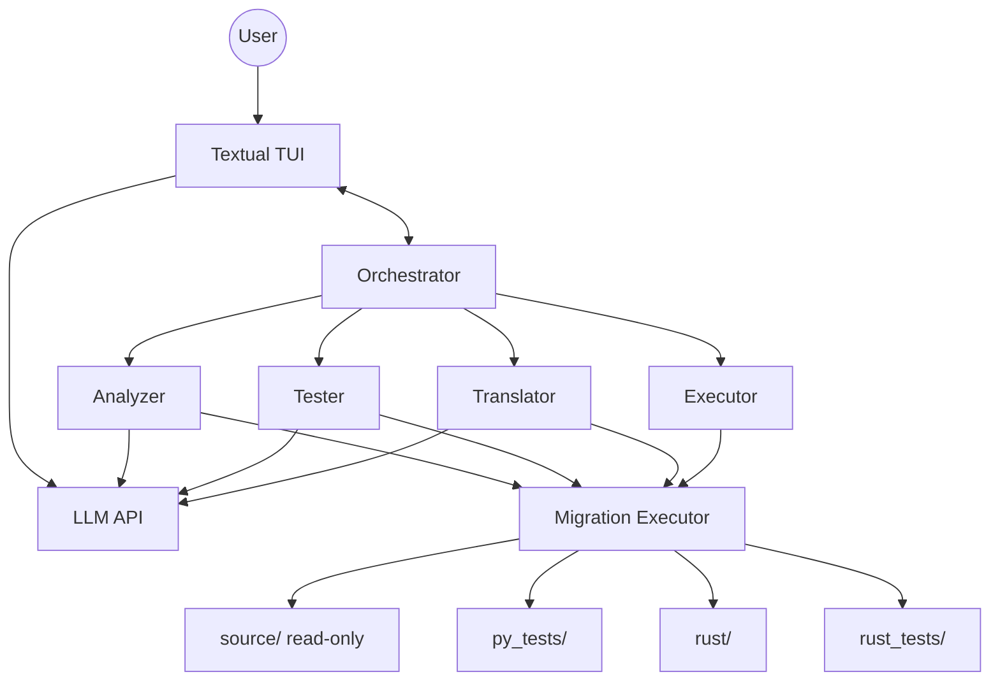
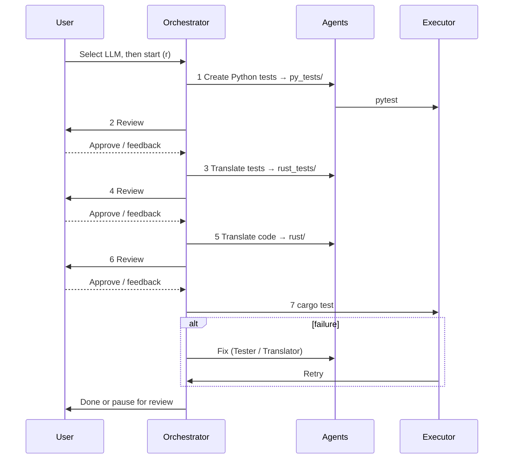

# Agentic Py2Rust Migrator

Migrates Python projects to Rust with test-driven workflow and human review. The **source project is never modified** — outputs go to sibling folders. A [Textual](https://textual.textualize.io/) TUI runs the pipeline; at startup you pick an **LLM provider and model**.

## Architecture



**Agents:** Analyzer (plan), Tester (Python + Rust tests), Translator (Rust code), Executor (`pytest` / `cargo test`).

**On disk** (for `myproject/` at `/path/to/`):

```text
myproject/                      # read-only
myproject_migration_py_tests/   # migration_plan.md, pytest
myproject_migration_rust/       # Cargo.toml, src/
myproject_migration_rust_tests/ # integration tests
```

Tool paths: `source/`, `py_tests/`, `rust/`, `rust_tests/` (writes to `source/` are blocked).

## Workflow



| Key | Action |
|-----|--------|
| **r** | Start |
| **a** | Approve review |
| **s** | Feedback (re-run prior step) |
| **m** | Change model |
| **q** | Quit |

## Setup

**Requires:** [uv](https://docs.astral.sh/uv/), `pytest`, `cargo`, and at least one LLM provider.

| Variable | When |
|----------|------|
| `OPENAI_API_KEY` | OpenAI (optional `OPENAI_BASE_URL`) |
| `CURSOR_BRIDGE_BASE_URL` | Optional override (default `http://127.0.0.1:8765/v1`) for [cursor-api-proxy](https://github.com/anyrobert/cursor-api-proxy) |
| `CURSOR_BRIDGE_API_KEY` / `CURSOR_API_KEY` | Optional bridge auth |

Providers are checked at startup (`/v1/models`). The app errors only if **none** work.

```bash
uv sync
export OPENAI_API_KEY=sk-...
uv run orchestrator -w /path/to/python/project
```

## Executor MCP

Optional stdio MCP for Cursor: `uv run executor-mcp` (see [`.cursor/mcp.json`](.cursor/mcp.json)). The TUI uses the same tools in-process via [`orchestrator/migration_executor.py`](orchestrator/migration_executor.py).

Main code: [`orchestrator/`](orchestrator/), [`agents/`](agents/), [`llm/`](llm/), [`executor_mcp/`](executor_mcp/).
