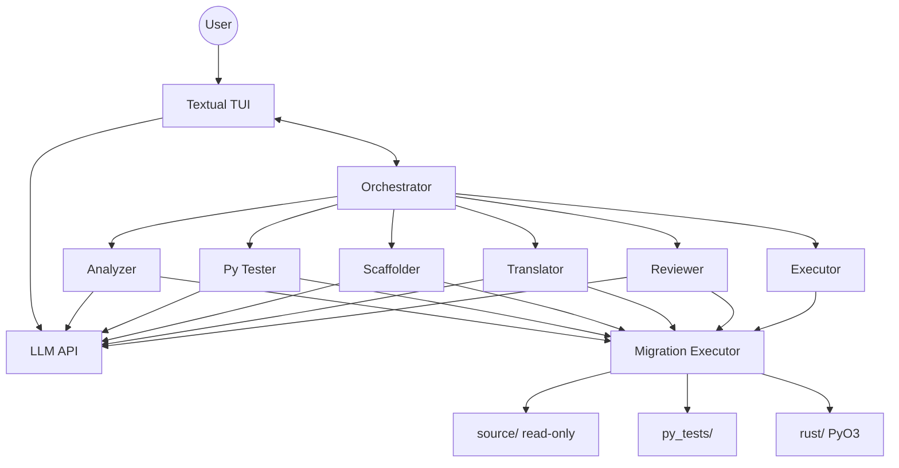
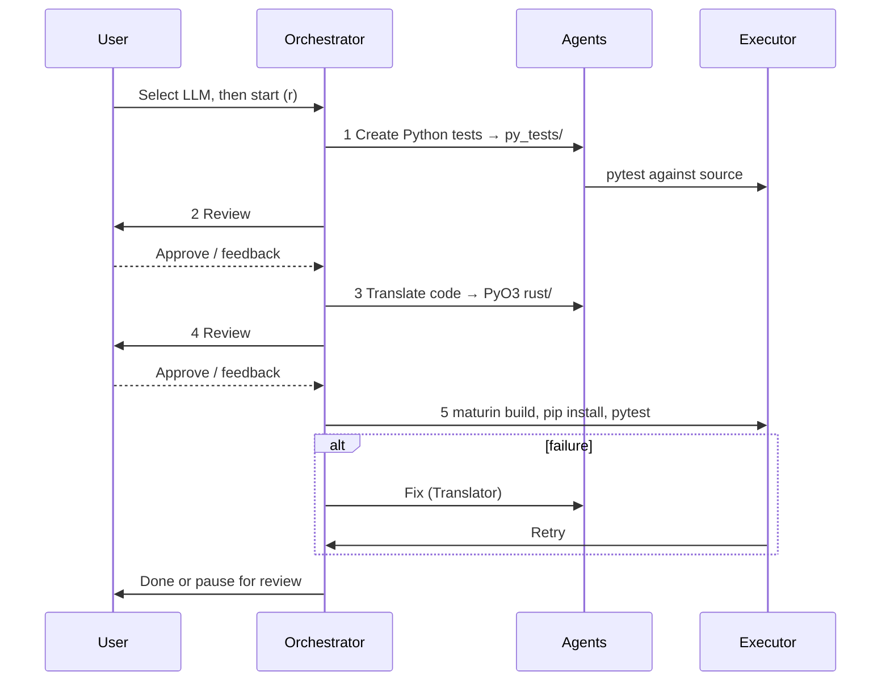

# Agentic Py2Rust Migrator

Migrates Python projects to Rust with test-driven workflow and human review. The **source project is never modified** — outputs go to sibling folders. A [Textual](https://textual.textualize.io/) TUI runs the pipeline; at startup you pick an **LLM provider and model**.

## Architecture



**Agents:** Analyzer (plan), Py Tester (pytest contract), Scaffolder (PyO3 skeleton), Translator (PyO3 implementation), Reviewer (pre-review briefs), Executor (`maturin` + `pytest`).

**On disk** (for `myproject/` at `/path/to/`):

```text
myproject/                      # read-only
myproject_migration_py_tests/   # migration_plan.md, pytest
myproject_migration_rust/       # Cargo.toml, pyproject.toml, PyO3 src/
```

Tool paths: `source/`, `py_tests/`, `rust/` (writes to `source/` are blocked).

## Workflow



| Key | Action |
|-----|--------|
| **r** | Start |
| **a** | Approve review |
| **s** | Feedback (re-run prior step) |
| **m** | Change model |
| **q** | Quit |

## Setup

**Requires:** [uv](https://docs.astral.sh/uv/), `pytest`, `cargo`, `maturin`, and at least one LLM provider.

| Variable | When |
|----------|------|
| `OPENAI_API_KEY` | OpenAI (optional `OPENAI_BASE_URL`) |
| `CURSOR_BRIDGE_BASE_URL` | Optional override (default `http://127.0.0.1:8765/v1`) for [cursor-api-proxy](https://github.com/anyrobert/cursor-api-proxy) |
| `CURSOR_API_KEY` | **Required for chat** via the bridge (see below). Passed to the proxy’s spawned `agent` process. |

Providers are checked at startup (`/v1/models`). The app errors only if **none** work.

### Cursor bridge (cursor-api-proxy)

`agent login` alone is **not enough** for the proxy: by default it runs each request in an isolated temp workspace and overrides `HOME` / `CURSOR_CONFIG_DIR`, so the child `agent` cannot see your login from `~/.cursor`.

1. Install the Cursor agent CLI and add it to `PATH` (`~/.local/bin`).
2. Create an API key: [Cursor Dashboard → Integrations](https://cursor.com/dashboard/integrations) → API Keys.
3. Start the proxy **in the same terminal** with the key exported:

```bash
export PATH="$HOME/.local/bin:$PATH"
export CURSOR_API_KEY="cursor_..."   # your key from the dashboard
npx cursor-api-proxy
```

4. Verify chat works:

```bash
curl http://127.0.0.1:8765/v1/models
curl http://127.0.0.1:8765/v1/chat/completions \
  -H 'Content-Type: application/json' \
  -d '{"model":"composer-2-fast","messages":[{"role":"user","content":"Say OK"}],"max_tokens":16}'
```

5. Run the migrator in another terminal: `uv run orchestrator -w /path/to/project`

Optional: `CURSOR_BRIDGE_API_KEY` if you want the HTTP API itself to require `Authorization: Bearer …` (separate from `CURSOR_API_KEY` for the agent).

**“cursor-user is missing from keychain”** — The CLI normally stores login in the macOS Keychain. That fails or is invisible when:

- the proxy spawns `agent` with a fake `HOME` (default for cursor-api-proxy), or
- you use SSH / a non-GUI terminal where Keychain access is blocked.

Use **`CURSOR_API_KEY`** (above) instead of relying on `agent login` for the bridge. To fix Keychain for direct `agent` use, run `agent logout` then `agent login` in **Terminal.app** on the Mac itself (not over SSH), and allow Keychain access when prompted.

```bash
uv sync
export OPENAI_API_KEY=sk-...
uv run orchestrator -w /path/to/python/project
```

## Executor MCP

Optional stdio MCP for Cursor: `uv run executor-mcp` (see [`.cursor/mcp.json`](.cursor/mcp.json)). The TUI uses the same tools in-process via [`orchestrator/migration_executor.py`](orchestrator/migration_executor.py).

Main code: [`orchestrator/`](orchestrator/), [`agents/`](agents/), [`llm/`](llm/), [`executor_mcp/`](executor_mcp/).
