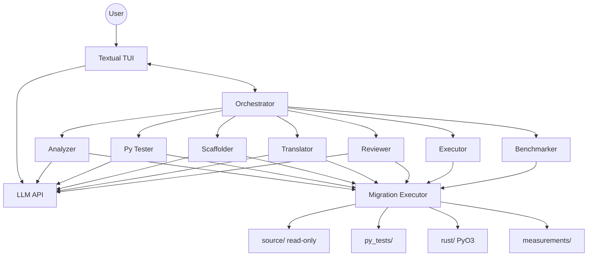
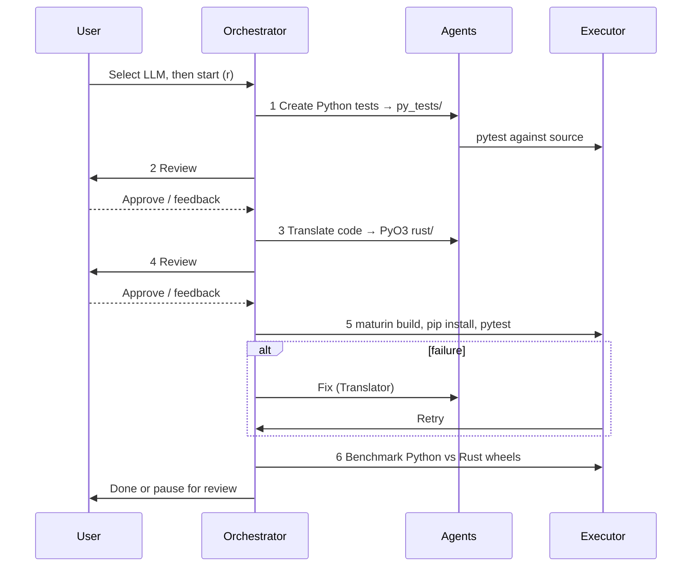

# Agentic Py2Rust Migrator

Migrates Python projects to Rust with test-driven workflow and human review. The **source project is never modified** — outputs go to sibling folders. A [Textual](https://textual.textualize.io/) TUI runs the pipeline; at startup you pick an **LLM provider and model**.

## Architecture



**Agents:** see [Agents](#agents) below for roles, tools, and when each runs.

**On disk** (for `myproject/` at `/path/to/`):

```text
myproject/                      # read-only
myproject_migration_py_tests/   # migration_plan.md, pytest
myproject_migration_rust/       # Cargo.toml, pyproject.toml, PyO3 src/
myproject_measurements/         # benchmark CSV, TXT, graphs (step 6)
```

Tool paths: `source/`, `py_tests/`, `rust/`, `measurements/` (writes to `source/` are blocked).

## Workflow



| Key | Action |
|-----|--------|
| **r** | Resume detected progress / start |
| **R** | Start fresh (clears checkpoint) |
| **a** | Approve review |
| **s** | Feedback (re-run prior step) |
| **m** | Change model |
| **↑ / ↓** | Select active agent run |
| **f** | Cycle activity log filter (all / selected run / role) |
| **c** | Toggle compact layout |
| **x** | Cancel active agent runs |
| **q** | Quit |

On startup the orchestrator **detects migration progress** from a checkpoint file
(`py_tests/.orchestrator/state.json`) or by inferring artifacts on disk. Press **r** to
resume at the detected step, or **R** to restart from step 1.

```bash
# Print detected step without opening the TUI
uv run orchestrator -w /path/to/project --detect-only
```

## Concurrent agents

Multiple agent instances can run in parallel when their write scopes do not overlap (for example, Py Tester shards per test file, or Translator shards per Rust source file).

| Variable | Default | Purpose |
|----------|---------|---------|
| `MAX_AGENT_CONCURRENCY` | `4` (OpenAI), `2` (Cursor bridge) | Max simultaneous agent LLM turns |

The TUI shows an **Active runs** table, a **pipeline strip**, concurrency slots (`▶ N/M slots`), and per-run detail when you select a row.

## Agents

The pipeline uses **nine coordinated roles**. Six are LLM-backed specialists; three are non-LLM infrastructure roles. The **Orchestrator** drives step order, human-review pauses, quality gates, fix loops, and **resume-after-restart**. The **Executor** runs shell commands (`pytest`, `cargo`, `maturin`) without an LLM. The **Benchmarker** runs deterministic performance measurement after migration tests pass.

| Agent | LLM | Write scope | Pipeline role |
|-------|-----|-------------|---------------|
| **Orchestrator** | No | — | Advances the 6-step workflow, checkpoints progress, pauses for human review, dispatches fix loops |
| **Analyzer** | Yes | `py_tests/` | Step 1 — reads the Python project and writes `migration_plan.md` |
| **Py Tester** | Yes | `py_tests/` | Step 1 — writes pytest that captures current Python behavior (can fan out per test file) |
| **Reviewer** | Yes | read-only | After steps 1 and 3 — produces a brief for the human before each review gate |
| **Scaffolder** | Yes | `rust/` | Step 3 — creates a compilable PyO3/maturin skeleton (`Cargo.toml`, `pyproject.toml`, `src/`) |
| **Translator** | Yes | `rust/` | Step 3 — implements PyO3 bindings; fixes failures after wheel pytest or clippy (can fan out per `.rs` file) |
| **Executor** | No | — | Runs `pytest`, `cargo fmt/clippy`, and `maturin build` + install; shown in the TUI during gates |
| **Benchmarker** | No | `measurements/` | Step 6 — builds Python + Rust wheels, times 100+ runs per case, writes CSV/TXT/graphs to `{project}_measurements/` |

### Orchestrator

**Intended function:** Workflow controller — not an LLM agent. Tracks the current step, resets agent status between stages, runs quality gates (flake8/mypy, baseline pytest, `cargo fmt/clippy`, maturin wheel + migration pytest), and pauses for human approve/feedback. Dispatches **Py Tester** or **Translator** fix agents when automated gates fail.

### Analyzer

**Intended function:** Discover and document the Python codebase before any tests or Rust work.

- Reads `source/` (read-only) via `read_file`, `get_api_signatures`, and `execute_command`
- Writes **`py_tests/migration_plan.md`**: module inventory, dependencies, migration risks, proposed test focus, proposed Rust/PyO3 layout
- Runs first in step 1, before Py Tester
- Does **not** write pytest or Rust code

### Py Tester

**Intended function:** Encode the Python project's public behavior as pytest — the contract for the migration.

- Uses API signatures and the migration plan to write tests under **`py_tests/tests/`**
- Python files are auto-formatted and linted (flake8/mypy) on write
- Runs baseline **`pytest`** against the original Python project (`PYTHONPATH=source`)
- On lint or pytest failure, re-invoked in a **fix loop** to repair tests
- Can run **multiple instances in parallel**, one per test file, when several modules exist

### Reviewer

**Intended function:** Prepare the human for approve/feedback decisions — read-only advisory agent.

- Invoked automatically after step 1 and step 3 complete successfully
- Reads artifacts in `source/`, `py_tests/`, and `rust/`; **never writes files**
- Returns a structured markdown brief: what changed, coverage vs plan, risks, suggested review focus
- Brief is appended to the TUI summary before the human review gate

### Scaffolder

**Intended function:** Bootstrap the PyO3 extension crate before implementation.

- Reads migration plan, approved pytest, and Python sources
- Writes **`rust/Cargo.toml`**, **`rust/pyproject.toml`**, and **`rust/src/`** stub modules with `#[pymodule]` and `todo!()` bodies
- Runs **`cargo check`** to ensure the skeleton compiles
- Runs **before** Translator in step 3; does **not** implement full logic or modify pytest

### Translator

**Intended function:** Implement the Python-to-PyO3 migration so the **same pytest suite** passes against the built wheel.

- Builds on Scaffolder output; writes only under **`rust/`**
- Must preserve the public Python API that pytest imports
- After step 3, **`cargo fmt --check`** and **`cargo clippy`** run as a quality gate; Translator fixes failures
- In step 5, if migration pytest fails after wheel install, Translator is dispatched to fix Rust/PyO3 code
- Can run **multiple instances in parallel**, one per `rust/src/*.rs` file (excluding `lib.rs`), when several modules exist

### Executor

**Intended function:** Deterministic command runner — not an LLM agent.

- **`pytest`** — baseline (against source) and migration (against installed wheel)
- **`cargo fmt --check`** / **`cargo clippy`** — Rust quality gate after translation
- **`maturin build`** + pip install — step 5 wheel build before migration pytest
- Status shown in the TUI agents table during command execution

### Benchmarker

**Intended function:** Deterministic performance comparison — not an LLM agent. Runs automatically as **Step 6** after migration pytest passes (Step 5).

- Builds a **Python source wheel** and uses the existing **Rust PyO3 wheel** (fair comparison — both installed via pip, not raw `PYTHONPATH`)
- Verifies Python and Rust outputs match before timing
- Runs benchmarks at four input tiers (**small → medium → large → xlarge**), 100+ iterations each (use `--quick` for 10)
- Measures latency, variance (CV%, percentiles), peak RSS, CPU%, and artifact sizes
- Writes reports to **`measurements/`** (`{project}_measurements/` on disk):

```text
report.txt, raw_runs.csv, summary.csv, metadata.json, graphs/*.png
```

- Optional custom cases: `measurements/benchmark_suite.toml`
- Also runnable standalone:

```bash
uv run benchmark-measurements -w /path/to/python/project
uv run benchmark-measurements -w /path/to/python/project --quick
```

See [`agents/benchmarker.py`](agents/benchmarker.py) for the full agent specification.

### Agent execution order (happy path)

```text
1. Analyzer → Py Tester → [lint + baseline pytest gates]
   → Reviewer → human review
2. Scaffolder → Translator → [fmt/clippy gate]
   → Reviewer → human review
3. Executor (maturin + migration pytest)
   → Benchmarker (Python vs Rust wheels, reports to measurements/)
   → done, or Translator fix loop on step 5 failure
```

## Setup

**Requires:** [uv](https://docs.astral.sh/uv/), `pytest`, `cargo`, `maturin`, `psutil`, `matplotlib`, and at least one LLM provider.

| Variable | When |
|----------|------|
| `OPENAI_API_KEY` | OpenAI (optional `OPENAI_BASE_URL`) |
| `CURSOR_BRIDGE_BASE_URL` | Optional override (default `http://127.0.0.1:8765/v1`) for [cursor-api-proxy](https://github.com/anyrobert/cursor-api-proxy) |
| `CURSOR_API_KEY` | **Required for chat** via the bridge (see below). Passed to the proxy’s spawned `agent` process. |
| `MAX_AGENT_CONCURRENCY` | Optional cap on parallel agent runs (provider-aware default) |

Providers are checked at startup (`/v1/models`). The app errors only if **none** work.

### Cursor bridge (cursor-api-proxy)

`agent login` alone is **not enough** for the proxy: by default it runs each request in an isolated temp workspace and overrides `HOME` / `CURSOR_CONFIG_DIR`, so the child `agent` cannot see your login from `~/.cursor`.

1. Install the Cursor agent CLI and add it to `PATH` (`~/.local/bin`).
2. Create an API key: [Cursor Dashboard → Integrations](https://cursor.com/dashboard/integrations) → API Keys.
3. Start the proxy **in the same terminal** with the key exported:

```bash
export PATH="$HOME/.local/bin:$PATH"
export CURSOR_API_KEY="cursor_..."   # your key from the dashboard
npx cursor-api-proxy
```

4. Verify chat works:

```bash
curl http://127.0.0.1:8765/v1/models
curl http://127.0.0.1:8765/v1/chat/completions \
  -H 'Content-Type: application/json' \
  -d '{"model":"composer-2-fast","messages":[{"role":"user","content":"Say OK"}],"max_tokens":16}'
```

5. Run the migrator in another terminal: `uv run orchestrator -w /path/to/project`

Optional: `CURSOR_BRIDGE_API_KEY` if you want the HTTP API itself to require `Authorization: Bearer …` (separate from `CURSOR_API_KEY` for the agent).

**“cursor-user is missing from keychain”** — The CLI normally stores login in the macOS Keychain. That fails or is invisible when:

- the proxy spawns `agent` with a fake `HOME` (default for cursor-api-proxy), or
- you use SSH / a non-GUI terminal where Keychain access is blocked.

Use **`CURSOR_API_KEY`** (above) instead of relying on `agent login` for the bridge. To fix Keychain for direct `agent` use, run `agent logout` then `agent login` in **Terminal.app** on the Mac itself (not over SSH), and allow Keychain access when prompted.

```bash
uv sync
export OPENAI_API_KEY=sk-...
uv run orchestrator -w /path/to/python/project
```

## Executor MCP

Optional stdio MCP for Cursor: `uv run executor-mcp` (see [`.cursor/mcp.json`](.cursor/mcp.json)). The TUI uses the same tools in-process via [`orchestrator/migration_executor.py`](orchestrator/migration_executor.py).

Main code: [`orchestrator/`](orchestrator/), [`agents/`](agents/), [`benchmark/`](benchmark/), [`llm/`](llm/), [`executor_mcp/`](executor_mcp/).
